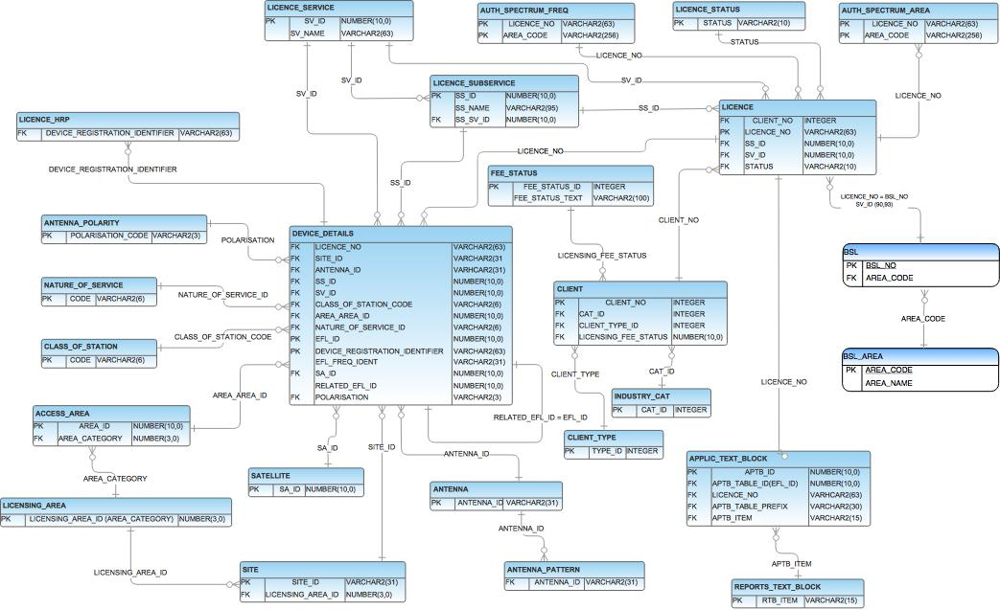

# ACMA Radiocommunications Database (MySQL schema)

> Based on Australian Communications and Media Authority information.

The Australian Communications and Media Authority maintains a register of radiocommunications licenses (RRL) which is available online at:
- [ACMA Register of Radiocommunications Licences](https://web.acma.gov.au/rrl/register_search.main_page)

A daily extract of the data is available from the ACMA in .csv format, along with an Oracle DB schema. This repository is a conversion of the schema to MySQL.

## Empty fields
Empty fields are denoted with ,, in the .csv files, these need to be explicitly modified to NULL for import into MySQL. Using two -e options in the sed command will capture mutiple adjacent NULL fields:

```bash
sed -i -e 's/,,/,NULL,/g' -e 's/,,/,NULL,/g' /path/to/file.csv
```

## Importing Data
Import the data to each table (ignoring the header row). See [import statements](import-statements.txt).

```sql
LOAD DATA INFILE '/var/www/html/<table>.csv'
INTO TABLE <table>
FIELDS TERMINATED BY ','
ENCLOSED BY '"'
LINES TERMINATED BY '\n'
IGNORE 1 ROWS;
```

## Entity Relationship Diagram (Oracle DB)

